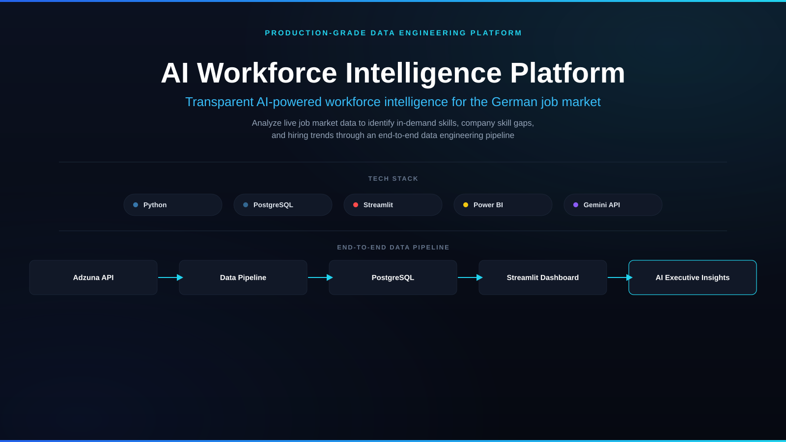
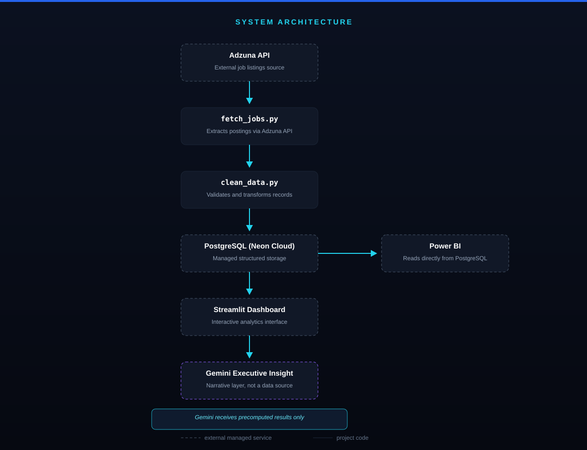
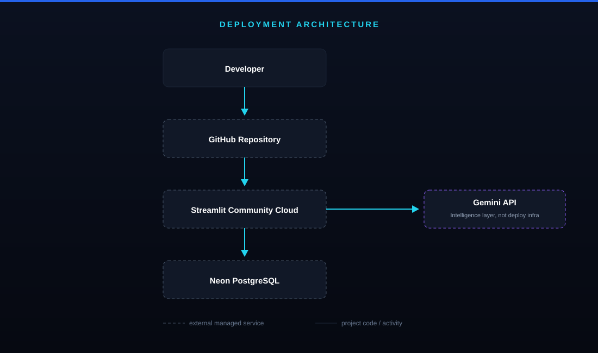
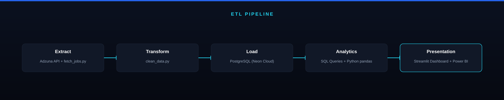
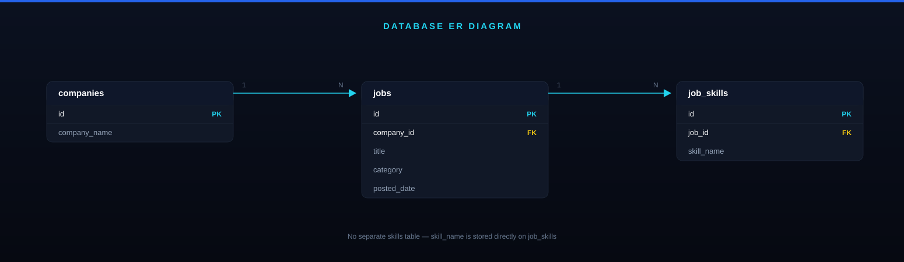
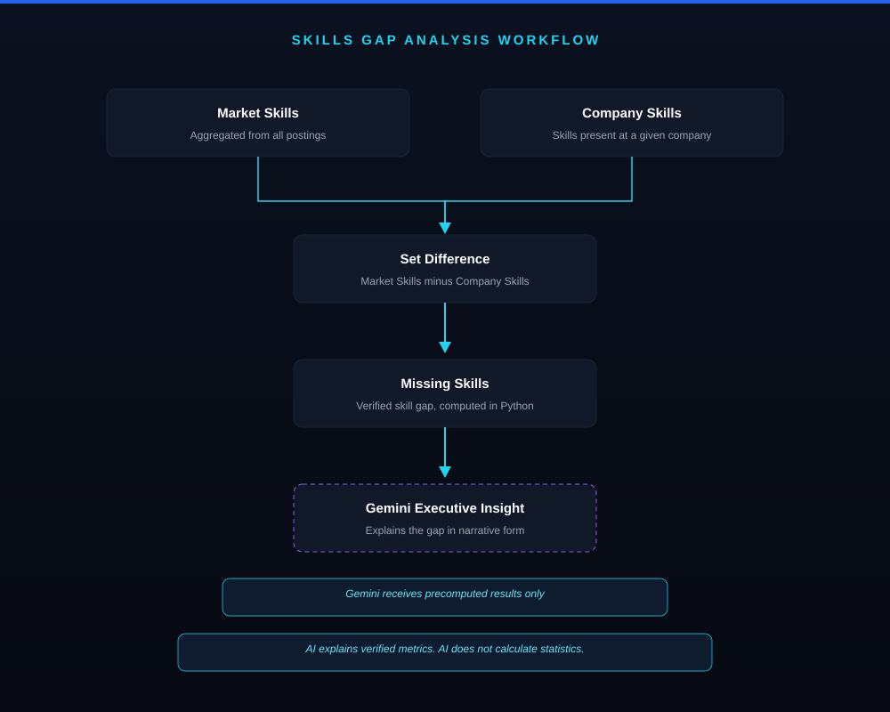
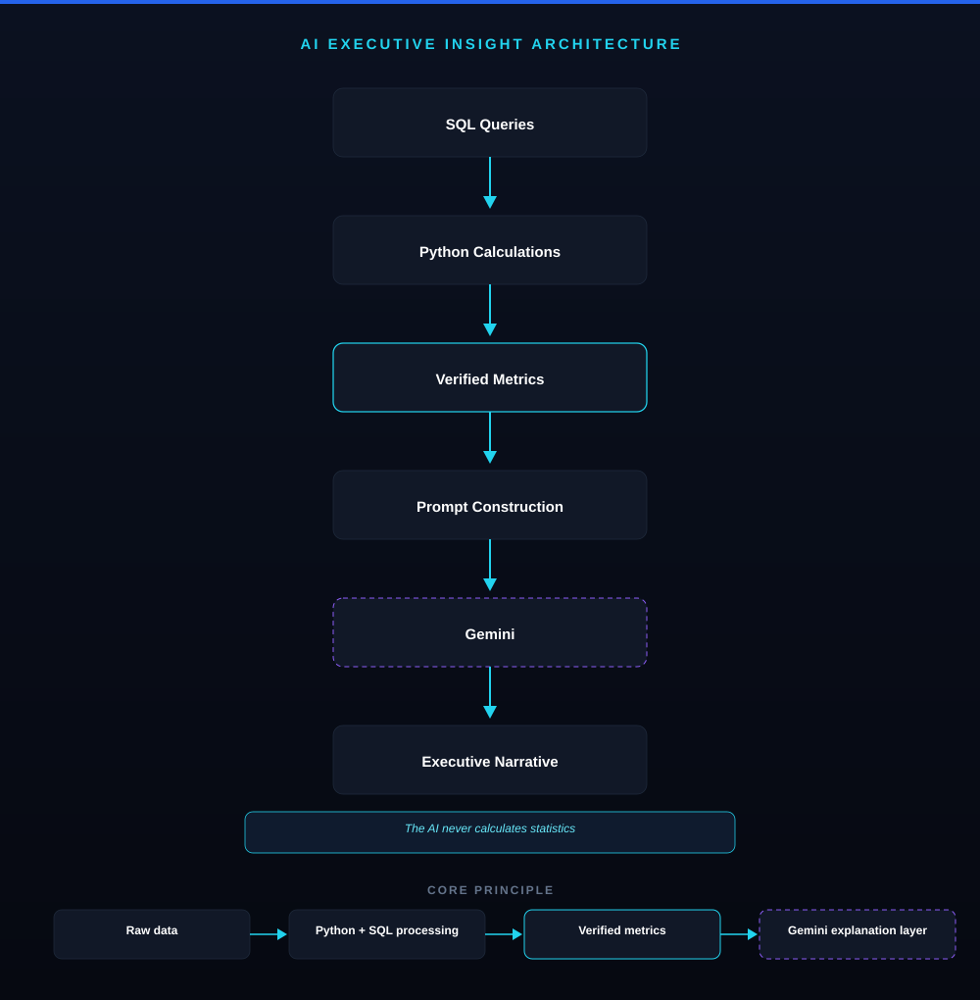
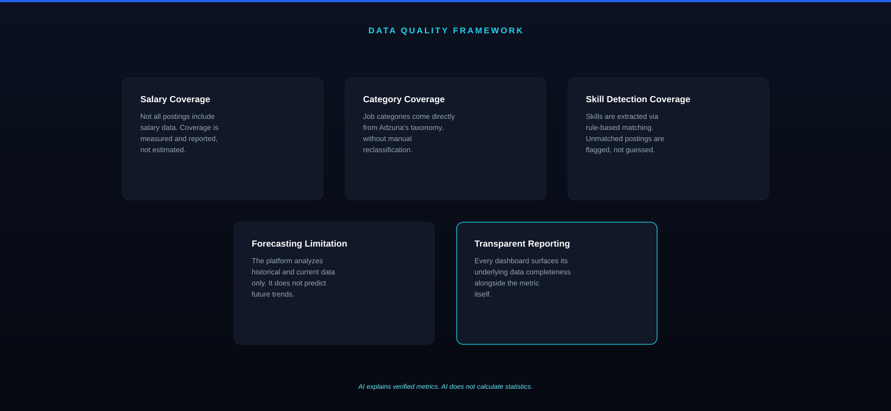

<div align="center">



### AI Workforce Intelligence Platform

An AI-powered workforce intelligence platform that transforms live German job market data into actionable hiring and workforce strategy insights — with explicit data quality reporting instead of false precision.

[](https://www.python.org/)
[](https://neon.tech/)
[](https://streamlit.io/)
[](https://powerbi.microsoft.com/)
[](https://ai.google.dev/)
[](#)

**🔗 [Live app](https://ai-workforce-intelligence-platform-july2026-kvvfa6vrauzrcnulce.streamlit.app/)** · **[GitHub](https://github.com/vanshdhiman090/Ai-workforce-intelligence-platform-July2026)**

</div>


---

## What this is

The AI Workforce Intelligence Platform is a decision-support system that converts raw job market data into structured, verified workforce intelligence. It identifies which skills are in demand, where a company's skill set diverges from the market, and what that gap means in practice — with an AI layer that explains those findings rather than generating them.

Most "market intelligence" dashboards present numbers with false confidence — clean charts that hide messy, incomplete, or biased source data. This platform does the opposite: every insight is paired with an explicit statement of its limitations, so a decision-maker can act on the signal without being misled by it.

## Why it matters

Workforce planning today is built on lagging, manually assembled reports. By the time a skills report reaches a hiring manager, the market has already moved. This platform closes that gap: it pulls current job market data, processes it through a transparent pipeline, and surfaces the result through both an interactive dashboard and a narrative AI layer — so workforce decisions are based on current data, not quarterly retrospectives.

---

## Table of contents

- [Product overview](#product-overview)
- [Business problem](#business-problem)
- [Product solution](#product-solution)
- [System architecture](#system-architecture)
- [Data pipeline](#data-pipeline)
- [Dashboard experience](#dashboard-experience)
- [Skill intelligence engine](#skill-intelligence-engine)
- [AI insight layer](#ai-insight-layer)
- [Self-service data refresh](#self-service-data-refresh)
- [Complete workflow](#complete-workflow)
- [Technology stack](#technology-stack)
- [Project structure](#project-structure)
- [Installation](#installation)
- [Environment variables](#environment-variables)
- [Usage](#usage)
- [Testing](#testing)
- [Roadmap](#roadmap)
- [Business impact](#business-impact)
- [Data quality and limitations](#data-quality-and-limitations)
- [Security and data privacy](#security-and-data-privacy)
- [Author](#author)

---

## Product overview

The platform is built for anyone who needs a current, evidence-based view of the German labour market:

- **HR and Talent Acquisition teams** — to understand what skills are actually being requested in live job postings, not last year's survey.
- **Workforce and L&D analysts** — to identify where a company's existing skill base falls short of market demand.
- **Hiring managers and business leaders** — to get a concise, AI-generated executive summary instead of a raw data export.

It exists because workforce decisions are too often made on data that's already stale by the time it's reviewed. This platform keeps that loop short: ingest, verify, analyze, explain — and refresh on demand.

## Business problem

Organizations making workforce and hiring decisions typically face:

- **Data fragmentation** — job market signals, internal skill inventories, and hiring plans live in disconnected spreadsheets and tools.
- **No real-time market visibility** — most workforce reports are point-in-time snapshots, often months old by the time they're acted on.
- **Difficulty identifying skill shortages** — comparing "what the market wants" against "what the company has" is usually a manual, ad hoc exercise.
- **Slow, expensive analysis cycles** — traditional workforce studies require significant analyst time to produce a single report.
- **False precision** — many analytics tools present incomplete data with the same confidence as complete data, quietly misleading the people who act on it.

## Product solution

The platform addresses this with an end-to-end intelligence pipeline, not a static report.

| Feature | Description |
|---|---|
| Labour Market Intelligence | Analyzes live job postings from the Adzuna API to quantify demand across roles, categories, and regions. |
| Skill Intelligence | Identifies the specific skills most frequently requested across current job postings, via word-boundary regex extraction. |
| Company Skill Gap | Compares a company's existing skill set against verified market demand — computed as a precise set difference, not an estimate. |
| AI Executive Insight | Converts verified metrics into a structured, four-part executive narrative (Hiring Focus, Market Comparison, Recommendation, Strategic Risk). The AI explains, it does not calculate. |
| Self-Service Refresh | A password-protected control that re-runs the full ingestion pipeline on demand, so the live dataset never requires a redeploy to stay current. |
| Analytics Dashboard | An interactive Streamlit interface, deployed live, plus a Power BI layer for deeper self-serve exploration. |

---

## System architecture



Data flows through five layers, each with a single responsibility:

1. **Data source** — the Adzuna job listings API, an external, managed source of German job posting data.
2. **Data pipeline** — `fetch_jobs.py` and `clean_data.py` extract, validate, and enrich incoming records; `run_pipeline.py` orchestrates both stages with failure detection and persistent logging.
3. **Database** — PostgreSQL, hosted on Neon Cloud, is the single source of truth for all processed data, loaded idempotently via `load_to_db.py`.
4. **Analytics and dashboard** — Streamlit reads directly from PostgreSQL to power interactive exploration; Power BI connects to the same database independently for deeper self-serve analysis.
5. **AI insight layer** — Gemini receives precomputed, verified metrics from the dashboard layer and generates the executive narrative. It does not query the database directly and does not compute statistics itself.

### Deployment



The application is deployed as a lightweight, managed-service stack: code is version-controlled on GitHub, the dashboard runs on Streamlit Community Cloud, data is persisted on Neon PostgreSQL, and the Gemini API is called at runtime as an intelligence layer — it is not part of the deployment infrastructure itself.

## Data pipeline



**Collection.** Job postings are collected from the Adzuna job market API via `fetch_jobs.py`, across multiple search queries with paginated requests and exponential backoff on transient server errors.

**Processing.** `clean_data.py` handles deduplication, missing-value handling, and skill extraction from free-text postings using word-boundary regex matching (chosen specifically to avoid substring false positives, e.g. "Excel" incorrectly matching inside "excellent").

**Storage.** Processed records are stored in PostgreSQL (Neon Cloud) across three normalized tables:



- `companies` — the employer associated with a posting.
- `jobs` — individual postings, linked to a company via `company_id`.
- `job_skills` — extracted skills per posting, linked to a job via `job_id` (junction table for the many-to-many relationship between jobs and skills).

The loader is idempotent by design: re-running it never creates duplicate companies, jobs, or skill records, which makes scheduled or on-demand re-ingestion safe.

**Analysis.** Once stored, data is queried through SQL and aggregated with pandas to produce the verified metrics that feed both the dashboard and the AI insight layer.

## Dashboard experience

The Streamlit dashboard is the primary interface for exploring workforce intelligence. From it, users can:

- View live KPIs — total postings and companies currently in the database.
- Explore the top in-demand skills across current job postings.
- Filter live postings by city and browse the underlying job listings.
- Run a company-specific skill gap analysis.
- Review underlying data completeness alongside every metric shown, consistent with the platform's transparency principle.

Power BI is available as a parallel, self-serve analytics layer for users who prefer deeper ad hoc exploration outside the dashboard.

## Skill intelligence engine



The skill intelligence engine identifies:

- **Most demanded skills** — aggregated directly from current job postings.
- **Company-specific skill gaps** — computed as the set difference between market skills and a company's existing skill set.
- **Coverage boundaries** — the engine only produces a gap analysis for companies with at least one detected skill in their postings, rather than silently returning a misleading "100% gap" for companies with no underlying data.

The gap calculation itself is a straightforward set operation performed in Python — deterministic, auditable, and reproducible. The business value is in surfacing that gap clearly enough for a hiring or L&D team to act on it directly, rather than requiring a manual cross-reference exercise.

## AI insight layer



The AI layer's role is narrow and deliberate: it explains verified numbers, it does not produce them.

The flow is:

**Input** — structured, precomputed workforce metrics (a company's detected skills, overall market skills, and the resulting gap).

**AI reasoning** — Gemini (`gemini-flash-latest`) receives only these precomputed values inside a constrained prompt and generates a four-part executive narrative: Hiring Focus, Market Comparison, Recommendation, and Strategic Risk.

**Output** — a business-readable, ~180-word executive briefing grounded entirely in the metrics it was given, with an explicit instruction not to invent facts, figures, or technologies beyond what's supplied.

This separation matters: the AI never runs a query, never calculates a statistic, and never sees raw, unverified data. If a number appears in an AI-generated insight, it was computed by Python or SQL beforehand — not inferred by the model. Responses are cached (`@st.cache_data`) keyed on the underlying inputs, so repeated views of the same company don't trigger repeated API calls.

## Self-service data refresh

The dashboard includes a password-protected "Refresh Dataset" control that re-runs the entire ingestion pipeline — fetch, clean, load — directly from the running application, without requiring a code redeploy. On trigger, it:

1. Re-fetches current postings from the Adzuna API
2. Re-runs cleaning and skill extraction
3. Reloads the database idempotently (no duplicate records)
4. Clears the Streamlit cache so the dashboard immediately reflects the refreshed data

Access is gated by a secret password stored in deployment secrets, so the underlying API quota and database aren't exposed to arbitrary public triggering.

## Complete workflow

The end-to-end user journey through the platform:

1. **Collect** — job market data is pulled from the Adzuna API.
2. **Process** — records are cleaned, deduplicated, and skills are extracted.
3. **Analyze** — market-wide demand and trends are computed via SQL and pandas.
4. **Detect gaps** — a company's skill set is compared against verified market demand.
5. **Generate insight** — Gemini converts the resulting metrics into an executive narrative.
6. **Refresh on demand** — the dataset can be re-ingested live from within the app itself.
7. **Support decisions** — hiring managers and analysts act on the dashboard output and the AI summary together.

## Technology stack

| Layer | Technology |
|---|---|
| Programming | Python 3.13 |
| Data processing | pandas, SQLAlchemy |
| Database | PostgreSQL (Neon Cloud) |
| Analytics | SQL, pandas |
| Dashboard | Streamlit (deployed on Streamlit Community Cloud) |
| Visualization | Power BI |
| AI layer | Google Gemini API |
| Testing | pytest |
| Version control | Git, GitHub |

## Project structure

```
Ai-workforce-intelligence-platform-July2026/
│
├── src/
│   ├── fetch_jobs.py        # API ingestion (Adzuna)
│   ├── clean_data.py        # Cleaning, dedup, skill extraction
│   ├── load_to_db.py        # Idempotent database loader
│   ├── run_pipeline.py      # Orchestrator with logging & failure handling
│   ├── ai_insights.py       # Gemini-powered executive insight
│   └── app.py               # Streamlit application
│
├── sql/
│   ├── schema.sql           # Database schema (3 normalized tables)
│   └── analysis_queries.sql
│
├── tests/
│   ├── test_clean_data.py
│   └── test_skills_gap.py
│
├── docs/
│   └── forecasting_limitations.md
│
├── powerbi/
│   └── workforce_dashboard.pbix
│
├── data/
├── assets/
├── requirements.txt
└── README.md
```

## Installation

**Requirements**

- Python 3.13 or later
- A PostgreSQL connection (Neon Cloud or self-hosted)
- An Adzuna API app ID and key
- A Gemini API key

**Setup**

```bash
git clone https://github.com/vanshdhiman090/Ai-workforce-intelligence-platform-July2026.git
cd Ai-workforce-intelligence-platform-July2026

python -m venv src/.venv
source src/.venv/Scripts/activate   # Windows Git Bash
# source src/.venv/bin/activate     # macOS/Linux

pip install -r requirements.txt
```

**Run the application**

```bash
streamlit run src/app.py
```

## Environment variables

Create a `.env` file in the project root:

```
ADZUNA_APP_ID=
ADZUNA_APP_KEY=
DB_USER=
DB_PASSWORD=
DB_HOST=
DB_PORT=5432
DB_NAME=
GEMINI_API_KEY=
REFRESH_PASSWORD=
```

- `ADZUNA_APP_ID` / `ADZUNA_APP_KEY` — credentials for the Adzuna job listings API.
- `DB_USER` / `DB_PASSWORD` / `DB_HOST` / `DB_PORT` / `DB_NAME` — PostgreSQL (Neon Cloud) connection parameters.
- `GEMINI_API_KEY` — API key for the Gemini executive insight layer.
- `REFRESH_PASSWORD` — gates access to the in-app data refresh control.

When deployed on Streamlit Community Cloud, the same keys are set via the platform's **Secrets** manager instead of a local `.env` file; the app falls back automatically between the two.

Never commit `.env` or any file containing real credentials.

## Usage

1. Ensure the PostgreSQL database is reachable and the `DB_*` variables are set.
2. Run the full pipeline once to populate the database:
   ```bash
   python src/run_pipeline.py
   ```
3. Launch the dashboard:
   ```bash
   streamlit run src/app.py
   ```
4. Explore job demand, skill trends, and company skill gaps interactively.
5. Generate an AI executive summary from the current verified metrics.
6. Use the in-app "Refresh Dataset" control at any time to re-ingest current market data.

## Testing

```bash
pytest tests/ -v
```

Covers skill-extraction correctness (including the word-boundary regex fix that prevents substring false positives) and the skills-gap set-difference logic.

## Roadmap

**Completed**

- Full data pipeline (extraction, cleaning, idempotent loading), automated and logged
- Interactive Streamlit dashboard, deployed live
- Power BI analytics layer
- Skill gap analysis engine
- AI-generated executive insight layer
- Cloud database migration (Neon)
- Self-service, password-protected data refresh
- Automated test coverage (pytest)

**Planned**

- Additional labour market data sources (to reduce dependency on a single API's description-length limitations)
- Real historical trend analysis, once scheduled re-ingestion accumulates repeated snapshots over time
- CI (automated test runs on every push) and containerized (Docker) deployment
- A natural-language Q&A interface over the dataset, constrained to verified SQL results

## Business impact

**For HR and talent teams**

- Faster access to current skill demand data, reducing reliance on outdated reports.
- A clearer, evidence-based basis for hiring and upskilling priorities.
- Direct visibility into where a company's skill set diverges from the market.

**For organizations**

- Less manual analyst time spent assembling workforce reports.
- A repeatable, auditable process for workforce planning rather than a one-off exercise.
- Data that can be refreshed on demand rather than waiting on the next reporting cycle.

## Data quality and limitations



This platform is built on the principle that data limitations should be surfaced, not hidden. Specific, verified findings from this dataset:

| Finding | Detail |
|---|---|
| Skill detection is a lower bound | Only ~10–15% of postings have a detectable skill mention, because the source API truncates job descriptions at ~500 characters — often cutting off the requirements section before any keyword match is possible. This was diagnosed by reading real description samples, not assumed. |
| Category coverage gap | 54% of postings (422/787) have no category assigned by the source — shown explicitly as "Unknown" rather than silently excluded from aggregate views. |
| Salary data is sparse | Only ~5.6% of postings include salary figures; any salary-based claim is reported alongside this sample size. |
| Skills Gap Analysis coverage | Currently usable for roughly 19% of companies in the dataset, up from an initial ~13% after expanding the skill-detection vocabulary. Coverage remains capped by description truncation at the source, not by vocabulary size. |
| No forecasting, by design | The dataset is fundamentally built from ingestion snapshots; a genuine time-series trend requires repeated data collection over a meaningful period. Rather than build a forecast on insufficient history, this was investigated directly, found not yet honestly supportable, and documented in `docs/forecasting_limitations.md`. |
| AI recommendations inherit data limitations | The AI layer is only as reliable as the verified metrics it's given — if input coverage is incomplete, the AI narrative reflects that scope; it does not compensate for or paper over gaps in the underlying data. |

## Security and data privacy

- The platform does not collect unnecessary personal data; it processes publicly available job posting information.
- API keys and database credentials are managed exclusively through environment variables (locally) or a managed secrets store (in deployment), and are never hard-coded or committed to version control.
- The in-app data refresh control is gated by a separate secret password, distinct from database credentials, to limit who can trigger re-ingestion against the live API and database.

## Author

**Created by Vansh Dhiman**

Digital Business & Data Science student, focused on data analytics, AI-powered products, and workforce intelligence systems.

- GitHub: [github.com/vanshdhiman090](https://github.com/vanshdhiman090)
